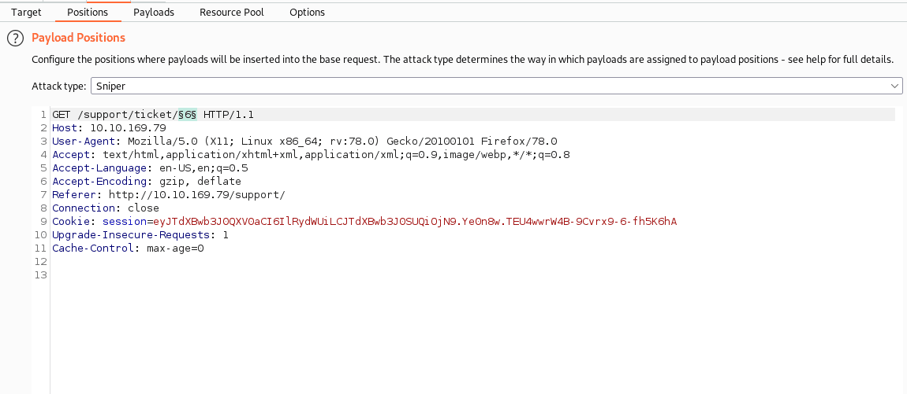

## task1
Intruder 允許我們自動化請求，這在 fuzzing 或 bruteforcing 時非常有用。    
## task2                 
```
Positions允許我們選擇攻擊類型（我們將在接下來的任務中介紹這些），以及配置我們希望在請求模板中插入有效負載的位置。
Payloads允許我們選擇要插入到我們在上一個子選項卡中定義的每個位置的值。例如，我們可以選擇從單詞列表中加載項目以用作有效負載。這些如何插入到模板中取決於我們在 Positions 選項卡中選擇的攻擊類型。有許多有效負載類型可供選擇（從簡單的單詞列表到基於服務器響應的正則表達式）。Payloads 子選項卡還允許我們更改 Intruder 關於有效負載的行為；例如，我們可以定義預處理規則以應用於每個有效負載（例如，添加前綴或後綴、匹配和替換，或者如果有效負載與定義的正則表達式匹配則跳過）。                                                                      
resource pool對 Burp 社區的我們來說並不是特別有用。它允許我們在任務之間分配資源。Burp Pro 將允許我們在後台運行各種類型的自動化任務，這是我們可能希望在這些自動化任務和 Intruder 之間手動分配可用內存和處理能力的地方。如果無法訪問這些自動化任務，使用它就沒有什麼意義，所以我們不會花太多時間在它上面。
與大多數其他 Burp 工具一樣，Intruder 允許我們在Options 子選項卡中配置攻擊行為。這裡的設置主要適用於 Burp 如何處理結果以及 Burp 如何處理攻擊本身。例如，我們可以選擇標記包含指定文本的請求或定義 Burp 如何響應重定向 (3xx) 響應。                                               
```
## task3
add$                                   
clear$                 
標記出插入有效負載的位置                                                     
## task4
4種攻擊介紹                        
* Sniper                   
* Battering ram                              
* Pitchfork              
* Cluster bomb              
## task5            
### sniper
採用一組有效載荷（例如一個單詞表）                                 
 Sniper 非常適合單位置攻擊（例如，如果我們知道用戶名，則使用密碼暴力破解或對 API 端點進行模糊測試）。                   
## task6
### battering ram
與 Sniper 一樣，Battering ram 採用一組有效載荷（例如一個單詞表）                         
但是battering ram 將相同的有效載荷放置在每個位置，而不是輪流放置在每個位置。                    
Battering ram 只是將有效載荷扔向目標，看看有什麼東西能粘住。                    
## task7
### pitchfork
狙擊手之後，乾草叉是你最有可能使用的攻擊類型。將 Pitchfork 想像成有許多 Snipers 同時運行可能會有所幫助。Sniper 使用一組有效載荷（它同時在每個位置使用），Pitchfork 每個位置使用一組有效載荷（最多 20 個）並一次遍歷它們。                                                 
這種攻擊類型在形成諸如撞庫攻擊之類的東西時非常有用
## task8
### cluster bomb
```
Cluster Bomb 將遍歷提供的有效載荷集的每個組合，以確保每一種可能性都經過測試。這種攻擊類型會產生大量流量（等於每個有效載荷集中的行數相乘），所以要小心！同樣，在使用 Burp Community 及其 Intruder 速率限制時，請注意，使用任何中等大小的有效載荷集進行集束炸彈攻擊將花費非常長的時間。                     

也就是說，對於不知道用戶名的任何類型的憑證暴力破解，這是另一種非常有用的攻擊類型。                  
```
## task9
payload 載入
## task10
## task11

.png)
## task12
### CSRF 令牌繞過
請求 http://10.10.213.185/admin/login/

```
Accept-Language: en-US,en;q=0.9

Cookie: session=eyJ0b2tlbklEIjoiMTQyNjllNDRlMTUxMmVhMDFhZDY0MTgwYzJkMzU4YTgifQ.Ye_7Fw.RwYm-N7J6JnQgLHiwdEP-YVXHuQ

Connection: close


username=admin&password=admin&loginToken=2fd9dfba2f12e2f8ba3e7a6f6e5e9443
```
看到一個cookie和一個token
這兩個都隨著每個請求而改變：這意味著我們每次發出請求時都需要為這兩個提取有效值          

換句話說，每次我們嘗試登錄時，我們都需要會話 cookie 和loginToken隱藏表單輸入的`唯一值`。    
我們必須定義一個“宏”（即一組簡短的重複動作）在每個請求之前執行。這將獲取一個唯一的會話 cookie 和匹配的登錄令牌，然後將它們替換為我們攻擊的每個請求。

```
attack type:pitchfork
一樣設好兩個payload 
然後點到project options
往下滑到marcos->add
選到method是GET的 /amdin/login 
新增好macro後 往上到session handling rules -> add ->scope
tools scope只勾intruder -> OK
到details的rule actions -> add -> run a marco

往下找到update only the following parameters -> edit
新增一個item-> loginToken

再往下找到一個update only the following parameters -> edit
新增一個item-> session

設好之後就能開始attack

```
