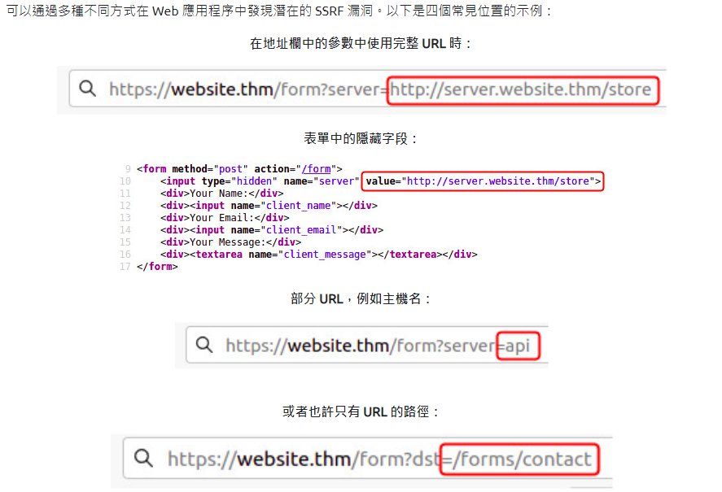

# task1
## 什麼是 SSRF？

SSRF 代表服務器端請求偽造。這是一個允許惡意用戶使網絡服務器向攻擊者選擇的資源發出附加或編輯的HTTP請求的漏洞。


## SSRF 的類型

SSRF 漏洞有兩種類型；第一個是常規的 SSRF，其中數據返回到攻擊者的屏幕。第二個是盲SSRF漏洞，發生SSRF，但沒有信息返回到攻擊者的屏幕。

## 有什麼影響？
成功的 SSRF 攻擊可能導致以下任何一種情況： 
```
進入未經授權的區域。

訪問客戶/組織數據。

能夠擴展到內部網絡。

顯示身份驗證令牌/憑據。
```
# task2 

更改地址以強製網絡服務器從 https://server.website.thm/flag?id=9 返回數據

` &x= 結尾的有效負載，用於阻止剩餘路徑附加到攻擊者 URL 的末尾，而是將其轉換為查詢字符串上的參數`

```
原本 https://website.thm/item/2?server=api

Server Requesting: 
https://api.website.thm/api/item?id=2

改成https://website.thm/item/2?server=server.website.thm/flag?id=9&x=

Server Requesting: 
https://server.website.thm/flag?id=9&x=.website.thm/api/item?id=2
```

# task3

# task4 
## 繞過
```

拒絕列表

拒絕列表是除了列表中指定的資源或匹配特定模式的資源之外的所有請求都被接受的地方。 Web 應用程序可以使用拒絕列表來保護敏感端點、IP 地址或域不被公眾訪問，同時仍然允許訪問其他位置。限制訪問的特定端點是 localhost，它可能包含服務器性能數據或其他敏感信息，因此 localhost 和 127.0.0.1 等域名將出現在拒絕列表中。攻擊者可以通過使用替代本地主機引用（例如 0、0.0.0.0、0000、127.1、127.*.*.*、2130706433、017700000001）或具有解析為 IP 地址 127.0.0.1的DNS記錄的子域來繞過拒絕列表例如 127.0.0.1.nip.io。


此外，在雲環境中，阻止對 IP 地址 169.254.169.254 的訪問將是有益的，該地址包含部署的雲服務器的元數據，包括可能的敏感信息。攻擊者可以通過使用指向 IP 地址 169.254.169.254的DNS記錄在他們自己的域上註冊一個子域來繞過這一點。


允許列表

允許列表是所有請求都被拒絕的地方，除非它們出現在列表中或匹配特定模式，例如參數中使用的 URL 必須以 https://website.thm 開頭的規則。 攻擊者可以通過在攻擊者的域名上創建子域來快速規避此規則，例如 https://website.thm.attackers-domain.thm。應用程序邏輯現在將允許此輸入並讓攻擊者控制內部HTTP請求。


打開重定向

如果上述繞過方法不起作用，攻擊者還可以使用另一種技巧，即開放重定向。開放式重定向是服務器上的一個端點，網站訪問者會自動重定向到另一個網站地址。以鏈接 https://website.thm/link?url=https://tryhackme.com 為例。創建此端點是為了記錄訪問者出於廣告/營銷目的而單擊此鏈接的次數。但是想像一下，有一個潛在的 SSRF 漏洞，它具有嚴格的規則，只允許以 https://website.thm/ 開頭的 URL。攻擊者可以利用上述功能將內部HTTP請求重定向到攻擊者選擇的域
```

# task5
`THM{YOU_WORKED_OUT_THE_SSRF}`